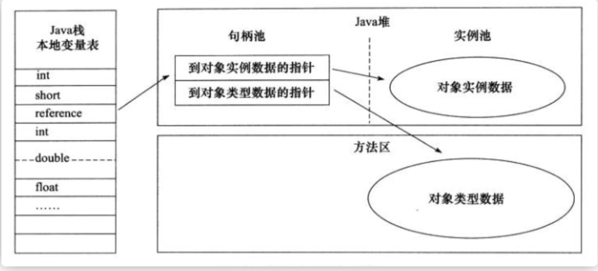

## 1.Java基础

### 1.字符型常量和字符串常量的区别

a).形式上：字符常量是单引号引起的一个字符；字符串常量是双引号引起的若干字符

b).含义上：字符串常量相当于一个整型值(ASCII)，可参加表达式运算；字符串常量代表一个地址值

c).占内存大小：字符常量只占2个字节；字符串常量占若干个字节（**注意 char在Java中两个字节 **）

### 2. Java 泛型，类型擦除，常用的通配符

 Java 泛型（generics）是 JDK 5 中引入的一个新特性, 泛型提供了编译时类型安全检测机制，该机制允许程序员在编译时检测到非法的类型。泛型的本质是参数化类型，也就是说所操作的数据类型被指定为一个参数。

**Java的泛型是伪泛型，这是因为Java在编译期间，所有的泛型信息都会被擦掉，这也就是通常所说类型擦除** 

```java
List<Integer> list = new ArrayList<>();

list.add(12);
//这里直接添加会报错
list.add("a");
Class<? extends List> clazz = list.getClass();
Method add = clazz.getDeclaredMethod("add", Object.class);
//但是通过反射添加，是可以的
add.invoke(list, "kl");

System.out.println(list)
```

> 泛型一般有三种使用方式：泛型类、泛型接口、泛型方法

**1.泛型类**

```java
//此处T可以随便写为任意标识，常见的如T、E、K、V等形式的参数常用于表示泛型
//在实例化泛型类时，必须指定T的具体类型
public class Generic<T>{ 
    private T key;
    public Generic(T key) { 
        this.key = key;
    }
    public T getKey(){ 
        return key;
    }
}
```

> 实例化泛型类

```java
Generic<Integer> genericInteger = new Generic<Integer>(123456);
```

**2.泛型接口**

```java
public interface Genertor<T>{
	public T method();
}
```

> 实现泛型接口，不指定类型

```java
class GeneratorImpl<T> implements Generator<T>{
    @Override
    public T method() {
        return null;
    }
}
```

> 实现泛型接口，指定类型

```java
class GeneratorImpl<T> implements Generator<String>{
    @Override
    public String method() {
        return "hello";
    }
}
```

**3.泛型方法**

```java
   public static < E > void printArray( E[] inputArray )
   {         
         for ( E element : inputArray ){        
            System.out.printf( "%s ", element );
         }
         System.out.println();
    }
```

> 使用

```java
// 创建不同类型数组： Integer, Double 和 Character
Integer[] intArray = { 1, 2, 3 };
String[] stringArray = { "Hello", "World" };
printArray( intArray  ); 
printArray( stringArray  ); 
```

**常用的通配符：T、E、K、V、？**

- ？ 表示不确定的 java 类型
- T (type) 表示具体的一个java类型
- K V (key value) 分别代表java键值中的Key Value
- E (element) 代表Element

**为什么要有 hashCode？**

我们以“`HashSet` 如何检查重复”为例子来说明为什么要有 hashCode？

当你把对象加入 `HashSet` 时，`HashSet` 会先计算对象的 hashcode 值来判断对象加入的位置，同时也会与其他已经加入的对象的 hashcode 值作比较，如果没有相符的 hashcode，`HashSet` 会假设对象没有重复出现。但是如果发现有相同 hashcode 值的对象，这时会调用 equals（）方法来检查 hashcode 相等的对象是否真的相同。如果两者相同，`HashSet` 就不会让其加入操作成功。如果不同的话，就会重新散列到其他位置。（摘自我的 Java 启蒙书《Head fist java》第二版）。这样我们就大大减少了 equals 的次数，相应就大大提高了执行速度。

**为什么重写 `equals` 时必须重写 `hashCode` 方法？**

如果两个对象相等，则 hashcode 一定也是相同的。两个对象相等,对两个对象分别调用 equals 方法都返回 true。但是，两个对象有相同的 hashcode 值，它们也不一定是相等的 。**因此，equals 方法被覆盖过，则 `hashCode` 方法也必须被覆盖。**

> `hashCode()`的默认行为是对堆上的对象产生独特值。如果没有重写 `hashCode()`，则该 class 的两个对象无论如何都不会相等（即使这两个对象指向相同的数据）

**为什么两个对象有相同的 hashcode 值，它们也不一定是相等的？**

在这里解释一位小伙伴的问题。以下内容摘自《Head Fisrt Java》。

因为 `hashCode()` 所使用的杂凑算法也许刚好会让多个对象传回相同的杂凑值。越糟糕的杂凑算法越容易碰撞，但这也与数据值域分布的特性有关（所谓碰撞也就是指的是不同的对象得到相同的 `hashCode`。

我们刚刚也提到了 `HashSet`,如果 `HashSet` 在对比的时候，同样的 hashcode 有多个对象，它会使用 `equals()` 来判断是否真的相同。也就是说 `hashcode` 只是用来缩小查找成本。

更多关于 `hashcode()` 和 `equals()` 的内容可以查看：[Java hashCode() 和 equals()的若干问题解答](https://www.cnblogs.com/skywang12345/p/3324958.html)

### 3.String 和 StringBuffffer、StringBuilder 的区别是什么？String 为什么是不可变的
**可变性**

> 简单的来说：String 类中使用 final 关键字字符数组保存字符串， private final char value[] ，所以 String对象是不可变的。而StringBuilder 与 StringBuffffer 都继承自 AbstractStringBuilder 类，在AbstractStringBuilder
> 中也是使用字符数组保存字符串 char[]value 但是没有用 final 关键字修饰，所以这两种对象都是可变的。
> StringBuilder 与 StringBuffffer 的构造方法都是调用父类构造方法也就是 AbstractStringBuilder 实现的，大家可以自行查阅源码。

AbstractStringBuilder.java

```java
abstract class AbstractStringBuilder implements Appendable, CharSequence {
char[] value;
int count;
AbstractStringBuilder() {
}
AbstractStringBuilder(int capacity) {
value = new char[capacity];
}
```

**线程安全性**

> String 中的对象是不可变的，也就可以理解为常量，线程安全。AbstractStringBuilder 是 StringBuilder 与StringBuffffer 的公共父类，定义了一些字符串的基本操作，如 expandCapacity、append、insert、indexOf 等公共方法。StringBuffffer 对方法加了同步锁或者对调用的方法加了同步锁，所以是线程安全的。StringBuilder 并没有对方法进行加同步锁，所以是非线程安全的。

**性能**

> 每次对 String 类型进行改变的时候，都会生成一个新的 String 对象，然后将指针指向新的 String 对象。StringBuffffer 每次都会对 StringBuffffer 对象本身进行操作，而不是生成新的对象并改变对象引用。相同情况下使用
> StirngBuilder 相比使用 StringBuffffer 仅能获得 10%~15% 左右的性能提升，但却要冒多线程不安全的风险。

**三者使用总结**

	1. 操作少量的数据 = String
	2. 单线程操作字符串缓冲区下操作大量数据 = StringBuilder
	3. 多线程操作字符串缓冲区下操作大量数据 = StringBuffffer
### 4.==与equals

> ==: 它的作用是判断两个对象的地址是不是相等。即，判断两个对象是不是同一个对象。(基本数据类型==比较的是值，引用数据类型==比较的是内存地址)
>
> equals() : 它的作用也是判断两个对象是否相等。但它一般有两种使用情况：
> 	情况1：类没有覆盖 equals() 方法。则通过 equals() 比较该类的两个对象     				  时，等价于通过“==”比较这两个对象。
> 	情况2：类覆盖了 equals() 方法。一般，我们都覆盖 equals() 方法来两个对				  象的内容相等；若它们的内容相等，则返回 true (即，认为这两个				  对象相等)

**例：**

```java
public class test1 {
	public static void main(String[] args) {
        String a = new String("ab"); // a 为一个引用
        String b = new String("ab"); // b为另一个引用,对象的内容一样
        String aa = "ab"; // 放在常量池中
        String bb = "ab"; // 从常量池中查找
        if (aa == bb) // true
        System.out.println("aa==bb");
        if (a == b) // false，非同一对象
        System.out.println("a==b");
        if (a.equals(b)) // true
        System.out.println("aEQb");
        if (42 == 42.0) { // true
        System.out.println("true");
		}
	}
}
```

**说明：**

- String中的equals方法是被重写过的，因为Object的equals方法是比较的对象的内存地址，而String的equals方法比较的是对象的值
- 当创建String类型的对象时，虚拟机会在常量池中查找有没有已经存在的值和要创建的值相同的对象，如果有就把它复制给当前引用。如果没有就在常量池中重新创建一个String对象。

### 5.集合

#### 5.1.ArrayList与LinkedList异同

- **是否保证线程安全：** ArrayList和LinkedList都是不同步的，即不保证线程安全。
- **底层数据结构：** ArrayList底层采用的是Object数组；LinkedList底层使用的使用双向链表数据结构（JDK1.6之
  前为循环链表，JDK1.7取消了循环。注意双向链表和双向循环链表的区别：）； 详细可阅读JDK1.7-LinkedList
  循环链表优化
- **插入和删除是否受元素位置的影响：① ArrayList 采用数组存储，所以插入和删除元素的时间复杂度受元素
  位置的影响。 比如：执行 add(E e) 方法的时候， ArrayList 会默认在将指定的元素追加到此列表的末尾，这种
  情况时间复杂度就是O(1)。但是如果要在指 ArrayList采用数组存储，所以插入和删除元素的时间复杂度受元素位置的影响** 。比如：执行 add(E e) 方法的时候， ArrayList 会默认在将指定的元素追加到此列表的末尾，这种
  情况时间复杂度就是O(1)。但是如果要在指定位置 i 插入和删除元素的话（ add(int index, E element) ）时
  间复杂度就为 O(n-i)。因为在进行上述操作的时候集合中第 i 和第 i 个元素之后的(n-i)个元素都要执行向后位/向
  前移一位的操作。**② LinkedList 采用链表存储，所以插入，删除元素时间复杂度不受元素位置的影响，都是
  近似 O（1）而数组为近似 O（n）**
- **是否支持快速随机访问：** LinkedList 不支持高效的随机元素访问，而 ArrayList 支持。快速随机访问就是通
  过元素的序号快速获取元素对象(对应于 get(int index) 方法)。
- **内存空间占用** ： ArrayList的空 间浪费主要体现在在list列表的结尾会预留一定的容量空间，而LinkedList的空
  间花费则体现在它的每一个元素都需要消耗比ArrayList更多的空间（因为要存放直接后继和直接前驱以及数
  据）。

#### 5.2 ArrayList 扩容机制

```java
1.向ArrayList中添加一个元素的时候即add()方法之前，会调用ensureCapacityInternal()方法，来判断是否需要扩容，2.ensureCapacityInternal()方法会判断数组是否是空数组，如果是空数组，10和minCapacity的较大值就作为新的minCapacity；接下来会传递minCapacity到ensureExplicitCapacity()方法中做进一步的判断。
    
3.接下来会判断我们传入的minCapacity 和 elementData.length的大小，如果 elementData.length大于minCapacity，说明数组容量够用，就不需要扩容。反之，则传入minCapacity到grow()方法中，开始扩容。
4.进入grow方法，我们会将newCapacity设置为旧容量的1.5倍，这也是ArrayList每次扩容都为原先容量1.5倍的由来。然后会进行判断，如果newCapacity小于minCapacity，那么就将minCapacity的值赋予newCapacity。
然后再检查新容量是否超出了定义的最大容量，如果超出则调用hugeCapacity方法，比较minCapacity和MAX_ARRAY_SIZE的值。如果minCapacity大，那么新容量为Integer.MAX_VALUE，否则新容量为MAX_ARRAYSIZ。最后调用Arrays.CopyOf传递elementData和新容量，返回新的elementData
```

> [详情](https://www.cnblogs.com/baichunyu/p/12965241.html)

#### 5.3 List循环删除元素

> 使用迭代器删除

```java
 List<Student> list = new ArrayList<>();
        list.add(new Student("male"));
        list.add(new Student("female"));
        list.add(new Student("female"));
        list.add(new Student("male"));
 
        //遍历删除,除去男生
        Iterator<Student> iterator = list.iterator();
        while (iterator.hasNext()) {
            Student student = iterator.next();
            if ("male".equals(student.getGender())) {
                iterator.remove();//使用迭代器的删除方法删除
            }

```

> 使用普通for循环删除**该方式删除元素下标不减一会导致元素删除不干净**

```java
		//准备数据
        List<Student> list = new ArrayList<>();
        list.add(new Student("male"));
        list.add(new Student("male"));
        list.add(new Student("female"));
        list.add(new Student("female"));
        list.add(new Student("male"));
 
        //普通for循环遍历删除
        for (int i = 0; i < list.size(); i++) {
            Student student = list.get(i);
            if ("male".equals(student.getGender())) {
                list.remove(i);//使用集合的删除方法删除
                i--;//★★★★★ 角标减一
            }
        }
        Log.d("普通for操作结果:", list.toString());
```


> 1.使用高级for循环遍历删除/增加元素时，如果在某次循环的过程中进行了删除或者是增加元素的操作，使用break或者return语句结束了循环操作，不报异常。
>
> 2.使用高级for循环遍历删除/增加元素时，除了1这种情况之外，必报ConcurrentModificationException异常。

```java
		//准备数据
        List<Student> list = new ArrayList<>();
        list.add(new Student("male"));
        list.add(new Student("female"));
        list.add(new Student("female"));
        list.add(new Student("male"));
 
        //遍历删除增强for循环除去男生
        for (Student student : list) {
            if ("male".equals(student.getGender())) {
                list.remove(student);//使用集合的删除方法删除
                break;//或者return
            }
        }
        Log.d("操作结果:", list.toString());

正常删除
```

<hr>

**没有break或return，报ConcurrentModificationException异常**

```java
      //高级for遍历删除元素，没有break/return
        for(Student student : list){
            if ("male".equals(student.getGender())) {
                list.remove(student);//使用集合的删除方法删除
            }
        }

```

#### 5.4 Map相关

##### 5.4.1 HashMap底层实现

**jdk1.8之前**

> JDK1.8 之前 HashMap 底层是 数组和链表 结合在一起使用也就是 链表散列。HashMap 通过 key 的 hashCode 经
> 过扰动函数处理过后得到 hash 值，然后通过 (n - 1) & hash 判断当前元素存放的位置（这里的 n 指的是数组的
> 长度），如果当前位置存在元素的话，就判断该元素与要存入的元素的 hash 值以及 key 是否相同，如果相同的
> 话，直接覆盖，不相同就通过拉链法解决冲突。
> 所谓扰动函数指的就是 HashMap 的 hash 方法。使用 hash 方法也就是扰动函数是为了防止一些实现比较差的
> hashCode() 方法 换句话说使用扰动函数之后可以减少碰撞。

**jdk1.8之后**

相比于之前的版本， JDK1.8之后在解决哈希冲突时有了较大的变化，当链表长度大于阈值（默认为8）时，将链表转化为红黑树，以减少搜索时间。

##### 5.4.2HashMap和Hashtable区别

1. **线程是否安全：** HashMap 是非线程安全的，HashTable 是线程安全的；HashTable 内部的方法基本都经过
   synchronized 修饰。（如果你要保证线程安全的话就使用 ConcurrentHashMap 吧！）；
2. **效率：** 因为线程安全的问题，HashMap 要比 HashTable 效率高一点。另外，HashTable 基本被淘汰，不要在代码中使用它；
3. **对Null key 和Null value的支持： **HashMap 中，null 可以作为键，这样的键只有一个，可以有一个或多个键所对应的值为 null。。但是在 HashTable 中 put 进的键值只要有一个 null，直接抛出 NullPointerException。
4. **初始容量大小和每次扩充容量大小的不同 ：** ①创建时如果不指定容量初始值，**Hashtable 默认的初始大小为11**，之后每次扩充，容量变为原来的2n+1。**HashMap 默认的初始化大小为16**。之后每次扩充，**容量变为原来
   的2倍。**②创建时如果给定了容量初始值，那么 Hashtable 会直接使用你给定的大小，而 HashMap 会将其扩充为2的幂次方大小（HashMap 中的 tableSizeFor() 方法保证，下面给出了源代码）。也就是说 HashMap 总
   是使用2的幂作为哈希表的大小,后面会介绍到为什么是2的幂次方。
5. **底层数据结构：** JDK1.8 以后的 HashMap 在解决哈希冲突时有了较大的变化，当链表长度大于阈值（**默认为8**）时，将链表转化为红黑树，以减少搜索时间。Hashtable 没有这样的机制.

 **hashMap添加元素的过程**


```
①.判断键值对数组table[i]是否为空或为null，否则执行resize()进行扩容；

②.根据键值key计算hash值得到插入的数组索引i，如果table[i]==null，直接新建节点添加，转向⑥，如果table[i]不为空，转向③；

③.判断table[i]的首个元素是否和key一样，如果相同直接覆盖value，否则转向④，这里的相同指的是hashCode以及equals；

④.判断table[i] 是否为treeNode，即table[i] 是否是红黑树，如果是红黑树，则直接在树中插入键值对，否则转向⑤；

⑤.遍历table[i]，判断链表长度是否大于8，大于8的话把链表转换为红黑树，在红黑树中执行插入操作，否则进行链表的插入操作；遍历过程中若发现key已经存在直接覆盖value即可；

⑥.插入成功后，判断实际存在的键值对数量size是否超多了最大容量threshold，如果超过，进行扩容
```


**HashMap中带有初始容量的构造函数**

```java
public HashMap(int initialCapacity, float loadFactor) {
	if (initialCapacity < 0)
		throw new IllegalArgumentException("Illegal initial 			capacity: " +initialCapacity);
	if (initialCapacity > MAXIMUM_CAPACITY)
		initialCapacity = MAXIMUM_CAPACITY;
    if (loadFactor <= 0 || Float.isNaN(loadFactor))
		throw new IllegalArgumentException("Illegal load factor: 			" +loadFactor);
		this.loadFactor = loadFactor;
		this.threshold = tableSizeFor(initialCapacity);
	}
public HashMap(int initialCapacity) {
		this(initialCapacity, DEFAULT_LOAD_FACTOR);
}

```

> 详细地址 https://blog.csdn.net/qq_27093465/article/details/52207152

##### 5.4.3ConcurrentHashMap

ConcurrentHashMap 

**底层数据结构：** jdk1.7中底层采用**分段的数组+链表** 实现，jdk1.8中采用**数组+链表/红黑树** 实现。数组是hashmap的主体，链表主要是为了解决**哈希冲突**存在的。

**实现线程安全的方式：** 

* 在jdk1.7时代，**ConcurrentHashMap(分段锁)** 对整个桶数组进行分段分割（segment），每一把锁只锁容器其中一部分数据，多线程访问容器里不同数据段的数据，就不会存在锁的竞争，提高并发访问率
* jdk1.8时，摒弃了分段锁（segment）的概念，而是直接用**Node数组+链表+红黑树** 的数据结构来实现，**并发控制使用synchronize和CAS来操作。（jdk1.6后对synchronize锁做了很多优化）**


**ConcurrentHashMap线程安全的具体实现方式/底层具体实现**

**JDK1.7**

```java 
首先将数据分为一段一段的存储，然后给每一段数据配一把锁，当一个线程占用锁访问其中一个段数据时，其他段的数据也能被其他线程访问。

concurrentHashMap是由Segment数据结构和HashEntry数据结构组成。

Segment实现了ReentrantLock，所以Segment是一种可重入锁，扮演锁的角色，hashEntry用于存储键值对数据。

static class Segment<K,V> extends ReentrantLock implements Serializable {
}
```

```
一个concurrentHashMap里包含一个Segment数组，segment的数据结构和HashMap类似，是一种数组和链表结构，一个Segment包含一个HashEntry数组，每个HashEntry是一个链表结构的元素，每个Segment守护着一个HashEntry数组里的元素，当对HashEntry数组的数据进行修改时，必须首先获得对应的Segment的锁。
```

**JDK1.8**

```
ConcurrentHashMap取消了Segment分段锁，采用CAS和synchronized来并发安全，数据结构跟HashMap1.8的结构类似，数组+链表/红黑树。

synchronized只锁定当前链表或红黑树的首节点，这样只要hash不冲突，就不会产生并发，效率得到提升。
```


## 2. JVM

### 2.1 jvm基本概念

> JVM是可运行Java代码的加项计算机，包括一套字节码指令集、一组寄存器、一个栈、一个垃圾回收，堆和一个存储方法域。JVM是运行在操作系统之上的，它与硬件没有直接的交互。


### 2.2 运行过程

> java源文件通过编译器编译产生.Class文件，即字节码文件，字节码文件又通过java虚拟机中的解释器，编译成特定机器上的机器码。过程如下：
>
> ① Java 源文件—->编译器—->字节码文件
> ② 字节码文件—->JVM—->机器码

### 2.3 JVM内存区域


#### 2.3.1线程私有

**程序计数器:**

```
1.一块较小的内存空间，	是当前线程所执行的字节码的行号指示器,每条线程都有一个独立的程序计数器

2.正在执行的java方法的话，计数器记录的是虚拟机字节码指令的地址(当前指令的地址)，如果是还是Native方法，则为空。

3.这个内存区域是唯一一个在虚拟机中没有规定任何内存溢出的情况。
```

**虚拟机栈：**

```
1.是描述java方法执行的内存模型，每个方法在执行的同时都会创建一个栈帧，用于存储局部变量表、操作数栈、动态链接、方法出口等信息。每一个方法从调用直至执行完成的过程，就对应一个栈帧在虚拟机栈中入栈到出栈的过程。

2.栈帧是用来存储数据和部分过程结果的数据结构，同时也被用来处理动态链接、方法返回值和异常分派。栈帧随着方法调用而创建，随着方法结束而销毁---无论方法是正常完成还是异常完成（抛出了在方法内未被捕获的异常）都算作方法结束。
```

**本地方法栈：**

```
本地方法区和 Java Stack 作用类似, 区别是虚拟机栈为执行 Java 方法服务, 而本地方法栈则为Native 方法服务, 如果一个 VM 实现使用 C-linkage 模型来支持 Native 调用, 那么该栈将会是一个C 栈，但HotSpot VM 直接就把本地方法栈和虚拟机栈合二为一.
```

#### 2.3.2线程共享

**堆(Heap)**

```
1.是被线程共享的一块内存区域，创建的对象和数组都保存在Java堆内存中，也是垃圾收集器进行垃圾收集的重要内存区域。

2.Java堆从GC的角度可以细分为：新生代(Eden区、From Survivor区和To Survivor区)、老年代和永久代(jdk1.8后摒弃了永久代采用元空间)。

```

**方法区：**

```
即我们常说的永久代(Permanent Generation), 用于存储被 JVM 加载的类信息、常量、静态变量、即时编译器编译后的代码等数据. HotSpot VM把GC分代收集扩展至方法区, 即使用Java堆的永久代来实现方法区, 这样 HotSpot 的垃圾收集器就可以像管理 Java 堆一样管理这部分内存, 而不必为方法区开发专门的内存管理器(永久带的内存回收的主要目标是针对常量池的回收和类型的卸载, 因此收益一般很小)。

```

**运行时常量池：** 是方法区的一部分，Class文件中除了有类的版本、字段、方法、接口等描述信息外还有一项是常量池。

用于存放编译期生成的各种字面量和符号引用，这部分内容将在类加载后存放到方法区的运行时常量池中。 Java 虚拟机对 Class 文件的每一部分（自然也包括常量池）的格式都有严格的规定，每一个字节用于存储哪种数据都必须符合规范上的要求，这样才会被虚拟机认可、装载和执行直接内存不属于JVM运行时数据区的一部分

### 2.4 垃圾回收与算法

#### 2.4.1如何确定垃圾

> 1.引用计数法
>
> 在对象中添加一个引用计数器，每当有一个地方引用它时，计数器值就加一；当引用失效时，计数器值就减一；任何时刻计数器为零的对象就是不可能再被使用的.

**注：引用计数法不能判断循环引用的问题**

> 2.可达性分析
>
> 为了解决引用计数法的循环引用问题，Java 使用了可达性分析的方法。通过一系列的“GC roots”对象作为起点搜索。如果在“GC roots”和一个对象之间没有可达路径，则称该对象是不可达的。

**要注意的是，不可达对象不等价于可回收对象，不可达对象变为可回收对象至少要经过两次标记过程。两次标记后仍然是可回收对象，则将面临回收**

#### 2.4.2 垃圾回收算法

> 1.标记清除算法（最基础的垃圾回收算法）

```
分为两个阶段，标记和清除，标记阶段标记出所有需要回收的对象，清除阶段回收被标记的对象所占用的空间。
```

**注，该算法会导致内存碎片化严重，后续可能发生大对象不能找到可利用空间的问题。**

> 2.复制算法

```
为了解决标记清除算法导致的内存碎片化而提出的，该算法是按内存容量将内存划分为等大小的两块，每次只是用其中的一块，当这一块内存满后将尚存活的对象复制到另一块上去，把已经使用的内存清掉。
```

**注：该算法虽实现简单，内存效率高，不易产生碎片，但会将可用内存压缩到了原本的一半，且存活对象增多的话，Copying算法效率大大降低。**


> 3.标记整理算法

```
结合了以上两个算法，为了避免缺陷而提出。标记阶段和 Mark-Sweep 算法相同，标记后不是清理对象，而是将存活对象移向内存的一端。然后清除端边界外的对象
```


> 4.分代收集算法

```
分代收集法是目前大部分 JVM 所采用的方法，其核心思想是根据对象存活的不同生命周期将内存划分为不同的域，一般情况下将 GC 堆划分为老生代(Tenured/Old Generation)和新生代(Young Generation)。老生代的特点是每次垃圾回收时只有少量对象需要被回收，新生代的特点是每次垃圾回收时都有大量垃圾需要被回收，因此可以根据不同区域选择不同的算法.

```

**4.1 新生代与复制算法**

```
大部分JVM 的GC对新生代采取标记复制算法，因为新生代中每次垃圾回收都要回收大部分对象，即要复制的操作比较少，但通常并不是按照 1：1 来划分新生代。一般将新生代划分为一块较大的 Eden 空间和两个较小的 Survivor 空间(From Space, To Space)，每次使用Eden 空间和其中的一块 Survivor 空间，当进行回收时，将该两块空间中还存活的对象复制到另一块 Survivor 空间中。
```

**4.2 老年代与标记整理算法**

```
而老年代因为每次只回收少量对象，因而采用 Mark-Compact 算法。
1. JAVA 虚拟机提到过的处于方法区的永生代(Permanet Generation)，它用来存储 class 类，常量，方法描述等。对永生代的回收主要包括废弃常量和无用的类。
2. 对象的内存分配主要在新生代的 Eden Space 和 Survivor Space 的 From Space(Survivor 目前存放对象的那一块)，少数情况会直接分配到老生代。
3. 当新生代的 Eden Space 和 From Space 空间不足时就会发生一次 GC，进行 GC 后，Eden Space 和 From Space 区的存活对象会被挪到 To Space，然后将 Eden Space 和 From Space 进行清理。
4. 如果 To Space 无法足够存储某个对象，则将这个对象存储到老生代。
5. 在进行 GC 后，使用的便是 Eden Space 和 To Space 了，如此反复循环。
6. 当对象在 Survivor 区躲过一次 GC 后，其年龄就会+1。默认情况下年龄到达 15 的对象会被移到老生代中。
```

### 2.5 java内存模型

jdk1.2之前，java的内存模型实现总是从**主存（共享内存）读取变量** 是不需要进行特别的注意。而在当前的java内存模型下，线程可以变量保存在**本地内存**(比如机器的寄存器)，而不是直接在主存中进行读写，这就可能造成一个线程在主存中修改了一个变量的值，而另外一个线程还在继续使用它在寄存器中的变量值的拷贝，造成**数据不一致**.


解决数据不一致的问题，就需要把变量声明为**volatile**，这指示jvm这个变量时不稳定的，每次使用它都到主存中进行读取。

**volatile** 关键字的主要作用就是**保证变量的可见性**，然后还有一个作用就是防止**指令重排序**。

### 2.6 垃圾收集器

待更新...

1.消息队列如何保证消息不被重复消费
2.redis缓存穿透
3.oracle如何实现数据库表自增
4.oracle与mysql区别
5.索引，联合索引
redis与中间件的区别

### 2.7 对象的创建

> java 创建对象的过程示意图


> 过程

1. **类加载检查**

   虚拟机遇到一条**new**指令时，首先将去检查这个指令的参数是否能在常量池中定位到这个类的符号引用，并且检查这个符号引用代表的类是否已被加载过、解析和初始化过。如果没有，那必须先执行相应的类加载过程。

2. **分配内存**

   在**类加载检查**通过后，接下来虚拟机将为新生对象**分配内存**。对象所需的内存大小在类加载完成后便可确定，为对象分配空间的任务等同于把一块确定大小的内存从 Java 堆中划分出来。**分配方式**有 **“指针碰撞”** 和 **“空闲列表”** 两种，**选择哪种分配方式由 Java 堆是否规整决定，而 Java 堆是否规整又由所采用的垃圾收集器是否带有压缩整理功能决定**。

   **内存分配的两种方式：（补充内容，需要掌握）**

   选择以上两种方式中的哪一种，取决于 Java 堆内存是否规整。而 Java 堆内存是否规整，取决于 **GC 收集器的算法是"标记-清除"，还是"标记-整理"（也称作"标记-压缩"），值得注意的是，复制算法内存也是规整的**

   

   **内存分配两种方式：**

   * 指针碰撞：
     * 适用场景：堆内存规整(即没有内存碎片)的情况下
     * 原理：用过的内存全部整合到一边，没有用过的内存放在另一边，中间有一个分界值指针，只需要向没有用过的内存方向将该指针移动对象内存大小位置即可
     * GC收集器;Serial,ParNew
   * 空闲列表：
     * 适用场景：**堆内存不规整的情况下**
     * 原理：虚拟机会维护一个列表，该列表中会记录哪些内存是可用的，在分配的时候，找一块是够大的内存来划分给对象实例，最后更新列表记录。
     * GC收集器：CMS

   **内存分配并发问题**

​         对于虚拟机来说，在创建对象的 时候必须要保证线程是安全的，通常采用两种方式来保证线程安全：

* **CAS+失败重试：** CAS是乐观锁的一种实现方式。所谓乐观锁就是，每次不加锁而是假设没有冲突二区完成某项操作，如果因为冲突失败就重试，直到成功为止。**虚拟机采用CAS配上失败重试的方式保证更新操作的原子性。**
* **TLAB:** 为每一个线程预先在**Eden区分配一块内存，JVM在给线程中的对象分配内存时**，**首先在TLAB分配**，当对象**大于TLAB中的剩余内存**或**TLAB的内存已用尽时**，再采用上述的CAS进行内存分配。

3. **初始化零值**

   内存分配完成后，虚拟机需要将分配到的**内存空间都初始化为零值（不包括对象头）**，这一步操作**保证了对象的实例字段**在 Java 代码中**可以不赋初始值就直接使用**，程序能访问到这些字段的数据类型所对应的零值。

4. **设置对象头**

   初始化零值完成之后，**虚拟机要对对象进行必要的设置**，例如这个对象是哪个类的实例、如何才能找到类的元数据信息、对象的哈希码、对象的 GC 分代年龄等信息。 **这些信息存放在对象头中。** 另外，根据虚拟机当前运行状态的不同，如是否启用偏向锁等，对象头会有不同的设置方式。

5. **执行init方法**

   在上面工作都完成之后，从虚拟机的视角来看，一个新的对象已经产生了，但从 Java 程序的视角来看，对象创建才刚开始，`` <init>方法还没有执行，所有的字段都还为零。所以一般来说，执行 new 指令之后会接着执行<init> `` 方法，把对象按照程序员的意愿进行初始化，这样一个真正可用的对象才算完全产生出来。

### 2.8 对象的内存布局

在 Hotspot 虚拟机中，对象在内存中的布局可以分为 3 块区域：**对象头**、**实例数据**和**对齐填充**。

**Hotspot 虚拟机的对象头包括两部分信息**，**第一部分用于存储对象自身的运行时数据**（哈希码、GC 分代年龄、锁状态标志等等），**另一部分是类型指针**，即对象指向它的类元数据的指针，虚拟机通过这个指针来确定这个对象是那个类的实例。

**实例数据部分是对象真正存储的有效信息**，也是在程序中所定义的各种类型的字段内容。

**对齐填充部分不是必然存在的，也没有什么特别的含义，仅仅起占位作用。** 因为 Hotspot 虚拟机的自动内存管理系统要求对象起始地址必须是 8 字节的整数倍，换句话说就是对象的大小必须是 8 字节的整数倍。而对象头部分正好是 8 字节的倍数（1 倍或 2 倍），因此，当对象实例数据部分没有对齐时，就需要通过对齐填充来补全。

### 2.9 对象的访问定位的两种方式

建立对象就是为了使用对象，我们的 Java 程序通过栈上的 reference 数据来操作堆上的具体对象。对象的访问方式由虚拟机实现而定，目前主流的访问方式有**①使用句柄**和**②直接指针**两种：

1. **句柄：** 如果使用句柄的话，那么 Java 堆中将会划分出一块内存来作为句柄池，reference 中存储的就是对象的句柄地址，而句柄中包含了对象实例数据与类型数据各自的具体地址信息；

   

2. **直接指针：** 如果使用直接指针访问，那么 Java 堆对象的布局中就必须考虑如何放置访问类型数据的相关信息，而 reference 中存储的直接就是对象的地址。

   

**这两种对象访问方式各有优势。使用句柄来访问的最大好处是 reference 中存储的是稳定的句柄地址，在对象被移动时只会改变句柄中的实例数据指针，而 reference 本身不需要修改。使用直接指针访问方式最大的好处就是速度快，它节省了一次指针定位的时间开销。**


> 详情见链接：

[资料链接](https://snailclimb.gitee.io/javaguide/#/docs/java/jvm/Java%E5%86%85%E5%AD%98%E5%8C%BA%E5%9F%9F?id=_31-%e5%af%b9%e8%b1%a1%e7%9a%84%e5%88%9b%e5%bb%ba)


## 3.多线程与高并发

### 3.1 Java中实现多线程有几种方式

#### 3.1.1 继承Thread类

#### 3.1.2 实现Runnable接口

#### 3.1.3 实现Callable接口通过FutureTask包装器来创建Thread线程

#### 3.1.4 使用ExecutorService、callable、Future实现有返回结果的多线程

#### 3.1.5 实现Runnable接口和Callable接口的区别

```
如果想让线程池执行任务的话需要实现的Runnable接口或Callable接口。 Runnable接口或Callable接口实现类都可以被ThreadPoolExecutor或ScheduledThreadPoolExecutor执行。两者的区别在于 Runnable接口不会返回结果但是Callable 接口可以返回结果。
备注：工具类Executors 可以实现Runnable 对象和Callable 对象之间的相互转换。 （Executors.callable（Runnable task）或Executors.callable（Runnable task，Object resule））
```

#### 3.1.5 执行execute()方法和submit（）方法的区别

**1）execute()方法用于提交不需要返回值的任务，因此无法判断任务是否被线程池执行成功与否。** 

**2）submit()方法用于提交需要返回值的任务，线程池会返回一个Future类型的对象，通过这个Future对象可以判断任务是否执行成功。** 并且可以通过**future的get()**方法来获取返回值，**get()方法会阻塞当前线程直到任务完成**，而使用 get（long timeout，TimeUnit unit）方法则会阻塞当前线程一段时间后立即返回，这时候有可能任务没有执行 完。


### 3.2 synchronized相关

#### 3.2.1 对synchronized关键字的了解

```
synchronized关键字解决的是多个线程之间访问资源的同步性，synchronized关键字可以保证被它修饰的方法或者代码块在任意时刻只能有一个线程执行。
另外，在 Java 早期版本中，synchronized属于重量级锁，效率低下，因为监视器锁（monitor）是依赖于底层的操作系统的 Mutex Lock 来实现的，Java 的线程是映射到操作系统的原生线程之上的。如果要挂起或者唤醒一个线程，都需要操作系统帮忙完成，而操作系统实现线程之间的切换时需要从用户态转换到内核态，这个状态之间的转换需要相对比较长的时间，时间成本相对较高，这也是为什么早期的 synchronized 效率低的原因。庆幸的是在 Java 6 之后Java 官方对从 JVM 层面对synchronized 较大优化，所以现在的 synchronized 锁效率也优化得很不错了。JDK1.6对锁的实现引入了大量的优化，如自旋锁、适应性自旋锁、锁消除、锁粗化、偏向锁、轻量级锁等技术来减少锁操作的开销。

```


#### 3.2.2 怎么使用synchronized关键字

**最主要的三种使用方式：**

```
1.修饰实例方法，作用于当前对象实例加锁，进入同步代码前要获得当前对象实例的锁。

2.修饰静态方法，作用于当前类对象加锁，进入同步代码前要获得当前类对象的锁。也就是给当前类加锁，会作用于类的所有对象实例，因为静态成员不属于任何一个实例对象，是类成员（ static 表明这是该类的一个静态资源，不管new了多少个对象，只有一份，所以对该类的所有对象都加了锁）。所以如果一个线程A调用一个实例对象的非静态 synchronized 方法，而线程B需要调用这个实例对象所属类的静态 synchronized 方法，是允许的，不会发生互斥现象，因为访问静态ynchronized 方法占用的锁是当前类的锁，而访问非静态synchronized 方法占用的锁是当前实例对象锁。

3.修饰代码块，指定加锁对象，对给定对象加锁，进入同步代码块前要获得给定对象的锁。和 synchronized 方法一样，synchronized(this)代码块也是锁定当前对象的。synchronized 关键字加到 static 静态方法和synchronized(class)代码块上都是是给 Class 类上锁。这里再提一下：synchronized关键字加到非 static 静态方法上是给对象实例上锁。另外需要注意的是：尽量不要使用 synchronized(String a) 因为JVM中，字符串常量池具有缓冲功能！


```


#### 3.2.3 synchronized 底层原理（）

**① synchronized 同步语句块的情况**

```java
public class SynchronizedDemo{
	public void method(){
		synchronized(this){
			System.out.println("synchronized 代码块")
		}
	}
}
```

**synchronized同步语句块的实现使用的是monitorenter和monitorexit指令，monitorenter指令指向同步代码的开始位置，monitorexit指令指明同步代码的结束位置。**

>  当执行 monitorenter 指令时，线程试图获取锁也就是获取 monitor(monitor对象存在于每个Java对象的对象头中，synchronized 锁便是通过这种方式获取锁的，也是为什么Java中任意对象可以作为锁的原因) 的持有权.当计数器为0则可以成功获取，获取后将锁计数器设为1也就是加1。相应的在执行 monitorexit 指令后，将锁计数器设为0，表明锁被释放。如果获取对象锁失败，那当前线程就要阻塞等待，直到锁被另外一个线程释放为止。

**② synchronized 修饰方法的的情况**

```java
public class SynchronizedDemo2{
	public synchronized void method(){
		System.out.println("synchronized方法");
	}
}
```

synchronized 修饰的方法并没有monitorenter和monitorexit指令，而是使用的是**ACC_SYNCHRONIZED**标识，该标识指明了改方法是一个同步方法，JVM通过该ACC_SYNCHRONIZED访问标志来辨别一个方法是否声明为同步方法，从而执行相应的同步调用

#### 3.2.4 JDK1.6之后synchronized关键字底层做了哪些优化

JDK1.6对锁的实现引入了大量的优化，如偏向锁、轻量级锁、自旋锁、适应性自旋锁、锁消除、锁粗化等技术来减少锁操作的开销。

> 锁主要存在四种状态，依次是无锁状态、偏向锁状态、轻量级锁状态、重量级锁状态，他们会随着竞争的激烈而逐渐升级，注意，锁可升级不可降级，这种策略是为了提高获得锁和释放锁的效率。

#### 3.2.5 synchronized和ReenTrantLock 区别

**① 两者都是可重入锁**

```
两者都是可重入锁。“可重入锁”概念是：自己可以再次获取自己的内部锁。比如一个线程获得了某个对象的锁，此时这个对象锁还没有释放，当其再次想要获取这个对象的锁的时候还是可以获取的，如果不可锁重入的话，就会造成死锁。同一个线程每次获取锁，锁的计数器都自增1，所以要等到锁的计数器下降为0时才能释放锁
```

**② synchronized 依赖于 JVM 而 ReenTrantLock 依赖于 API**

```
synchronized 是依赖于 JVM 实现的，前面我们也讲到了 虚拟机团队在 JDK1.6 为 synchronized 关键字进行了很多
优化，但是这些优化都是在虚拟机层面实现的，并没有直接暴露给我们。ReenTrantLock 是 JDK 层面实现的（也就是 API 层面，需要 lock() 和 unlock 方法配合 try/finally 语句块来完成），所以我们可以通过查看它的源代码，来看它是如何实现的。
```

**③ ReenTrantLock 比 synchronized 增加了一些高级功能**

相比synchronized，ReenTrantLock增加了一些高级功能。主要来说主要有三点：

**①等待可中断 ②可实现公平锁 ③可实现选择性通知（锁可以绑定多个条件）**

* **ReenTrantLock**提供了一种能够**中断等待锁的线程的机制**，通过**lock.lockInterruptibly()**来实现这个机制。也
  就是说正在等待的线程可以选择放弃等待，改为处理其他事情。
* **ReenTrantLock可以指定是公平锁还是非公平锁。而synchronized只能是非公平锁。**所谓的公平锁就是先等
  待的线程先获得锁。 **ReenTrantLock**默认情况是**非公平的**，可以通过 ReenTrantLock类的**ReentrantLock(boolean fair)** 构造方法来制定是否是公平的。
* **synchronized关键字与wait()和notify/notifyAll()方法相结合可以实现等待/通知机制**，ReentrantLock类当然也
  可以实现，但是需要借助于**Condition**接口**newCondition()** 方法。Condition是JDK1.5之后才有的，它具有很好的灵活性，比如可以实现多路通知功能也就是在一个Lock对象中可以创建多个Condition实例（即对象监视器），**线程对象可以注册在指定的Condition中，从而可以有选择性的进行线程通知，在调度线程上更加灵活** 在使用**notify/notifyAll()方法进行通知时，被通知的线程是由 JVM 选择的**，用ReentrantLock类结合Condition实例可以实现**“选择性通知”** ，这个功能非常重要，而且是Condition接口默认提供的。而synchronized关键字就相当于整个Lock对象中只有一个Condition实例，所有的线程都注册在它一个身上。如果执行notifyAll()方法的话就会通知所有处于等待状态的线程这样会造成很大的效率问题，而Condition实例的signalAll()方法 只会唤醒注册在该Condition实例中的所有等待线程。

#### 3.2.6 synchronized关键字和volatile关键字区别

* **volatile**关键字是线程同步的**轻量级实现**，所以volatile性能比synchronized要好。但是**volatile**关键字只能用于**变量**而**synchronized**关键字可以**修饰方法及代码块。** 
* **多线程访问volatile关键字不会发生阻塞，而synchronized可能会发生阻塞。**
* **volatile关键字能保证数据的可见性，但不能保证数据的原子性。synchronized关键字两者都能保证。** 
* **volatile主要用于解决变量在多个线程之间的可见性，而synchronized关键字解决的是多个线程之间访问资源的同步性。**

### 3.3 Atomic 原子类相关

> Atomic是指一个操作时不可中断的，即使是在多个线程一起执行的时候，一个操作一旦开始，就不会被其他线程干扰。

#### 3.3.1 java.util.concurrent(JUC)包中的原子类有哪4类

**基本类型** 
使用原子的方式更新基本类型

```
AtomicInteger：整形原子类 
AtomicLong：长整型原子类 
AtomicBoolean ：布尔型原子类
```

**数组类型** 
使用原子的方式更新数组里的某个元素

``` 
AtomicIntegerArray：整形数组原子类 AtomicLongArray：长整形数组原子类 AtomicReferenceArray ：引用类型数组原子类
```

**引用类型** 

```
AtomicReference：引用类型原子类
AtomicStampedRerence：原子更新引用类型里的字段原子类 
AtomicMarkableReference ：原子更新带有标记位的引用类型
```

**对象的属性修改类型** 

``` 
AtomicIntegerFieldUpdater:原子更新整形字段的更新器
AtomicLongFieldUpdater：原子更新长整形字段的更新器
AtomicStampedReference ：原子更新带有版本号的引用类型。该类将整数值与引用关联起来，可用于解决原 子的更新数据和数据的版本号，可以解决使用 CAS 进行原子更新时可能出现的 ABA 问题。
```

#### 3.3.2 AtomicIntger常用方法

```java
public final int get() //获取当前的值
public final int getAndSet(int newValue)//获取当前的值，并设置新的值
public final int getAndIncrement()//获取当前的值，并自增
public final int getAndDecrement() //获取当前的值，并自减
public final int getAndAdd(int delta) //获取当前的值，并加上预期的值
boolean compareAndSet(int expect, int update) //如果输入的数值等于预期值，则以原子方式将该值设置为输 入值（update）
public final void lazySet(int newValue)//最终设置为newValue,使用 lazySet 设置之后可能导致其他线程 在之后的一小段时间内还是可以读到旧的值。
```

#### 3.3.3 AtomicInteger 类的使用示例

> 使用AtomicInteger之后，不用对increment()方法加锁也可以保证线程安全。

```java
class AtomicIntegerTest {
        private AtomicInteger count = new AtomicInteger(); 
      //使用AtomicInteger之后，不需要对该方法加锁，也可以实现线程安全。
        public void increment() { 
                  count.incrementAndGet(); 
        }

       public int getCount() { 
                return count.get(); 
        }
}
```

#### 3.3.4 AtomicInteger 类的原理

> AtomicInteger 类主要利用CAS(compare and swap) + volatile 和native方法来保证原子性，从而 避免synchronized的高开销，执行效率大为提升。

**CAS的原理**是**拿期望的值和原本的一个值作比较**，**如果相同则更新成新的值**。UnSafe 类的 objectFieldOffset() 方法 是一个本地方法，这个方法是用来拿到**“原来的值”的内存地址，返回值是 valueOffset**。另外 **value 是一个volatile变 量，在内存中可见，因此 JVM 可以保证任何时刻任何线程总能拿到该变量的最新值。**

> 注： 详情见链接 

[JUC中的Atomic原子类总结](https://mp.weixin.qq.com/s?__biz=Mzg2OTA0Njk0OA==&mid=2247484834&idx=1&sn=7d3835091af8125c13fc6db765f4c5bd&source=41#wechat_redirect)

### 3.4 AQS 相关

> 详情连接为：

[AQS相关](https://mp.weixin.qq.com/s?__biz=Mzg2OTA0Njk0OA==&mid=2247484832&idx=1&sn=f902febd050eac59d67fc0804d7e1ad5&source=41#wechat_redirect)

#### 3.4.1 简述

> AQS的全称为（AbstractQueuedSynchronizer），这个类在java.util.concurrent.locks包下面。

> AQS是一个用来构建锁和同步器的框架，使用AQS能简单且高效地构造出应用广泛的大量的同步器，比如我们提到的 ReentrantLock，Semaphore，其他的诸如ReentrantReadWriteLock，SynchronousQueue，FutureTask等等皆是 基于AQS的。当然，我们自己也能利用AQS非常轻松容易地构造出符合我们自己需求的同步器。

#### 3.4.2 AQS原理分析

AQS核心思想是，**如果被请求的共享资源空闲，则将当前请求资源的线程设置为有效的工作线程，并且将共享资源设置为锁定状态。如果被请求的共享资源被占用，那么就需要一套线程阻塞等待以及被唤醒时锁分配的机制，这个机制AQS是用CLH队列锁实现的，即将暂时获取不到锁的线程加入到队列中。**

> CLH(Craig,Landin,and Hagersten)队列是一个虚拟的双向队列（虚拟的双向队列即不存在队列实例，仅存在结 点之间的关联关系）。AQS是将每条请求共享资源的线程封装成一个CLH锁队列的一个结点（Node）来实现锁 的分配

AQS使用一个**int成员变量**来表示同步状态，通过内置的FIFO队列来完成获取资源线程的排队工作。AQS使用**CAS**对该 同步状态进行原子操作实现对其值的修改。

```java
private volatile int state;//共享变量，使用volatile修饰保证线程可见性
```

> 状态信息通过procted类型的getSate，setState,compareAndSetState进行操作

```java
//返回同步状态的当前值
protected final int getState() { 
        return state;
}
 // 设置同步状态的值
protected final void setState(int newState) { 
        state = newState;
}
//原子地（CAS操作）将同步状态值设置为给定值update如果当前同步状态的值等于expect（期望值）
protected final boolean compareAndSetState(int expect, int update) { 
        return unsafe.compareAndSwapInt(this, stateOffset, expect, update);
}
```

#### 3.4.3 AQS 对资源的共享方式

**AQS定义两种资源共享方式** 

* **Exclusive (独占)：**只有一个线程能执行，如ReentrantLock。又可分为公平锁和非公平锁： 

     公平锁：按照线程在队列中的排队顺序，先到者先拿到锁
     非公平锁：当线程要获取锁时，无视队列顺序直接去抢锁，谁抢到就是谁的 

* **Share(共享)** ：多个线程可同时执行，如Semaphore/CountDownLatch。Semaphore、
  CountDownLatCh、 CyclicBarrier、ReadWriteLock

**AQS组件总结**

* **Semaphore(信号量)-允许多个线程同时访问**： synchronized 和 ReentrantLock 都是一次只允许一个线程访问某个资源，Semaphore(信号量)可以指定多个线程同时访问某个资源。
* **CountDownLatch （倒计时器）**： CountDownLatch是一个同步工具类，用来协调多个线程之间的同步。这 个工具通常用来控制线程等待，它可以让某一个线程等待直到倒计时结束，再开始执行。
* **CyclicBarrier(循环栅栏)**： CyclicBarrier 和 CountDownLatch 非常类似，它也可以实现线程间的技术等待， 但是它的功能比 CountDownLatch 更加复杂和强大。主要应用场景和 CountDownLatch 类似。CyclicBarrier 的字面意思是可循环使用（Cyclic）的屏障（Barrier）。它要做的事情是，让一组线程到达一个屏障（也可以叫 同步点）时被阻塞，直到最后一个线程到达屏障时，屏障才会开门，所有被屏障拦截的线程才会继续干活。 CyclicBarrier默认的构造方法是 CyclicBarrier(int parties)，其参数表示屏障拦截的线程数量，每个线程调用 await方法告诉 CyclicBarrier 我已经到达了屏障，然后当前线程被阻塞。

**AQS 原理和相关源码分析的文章：**

* https://www.cnblogs.com/waterystone/p/4920797.html
* https://www.cnblogs.com/chengxiao/archive/2017/07/24/7141160.html


## 4.网络 


## 5.数据结构与算法


## 6.数据库

### 6.1 mysql

> SQL语⾔言共分为四⼤大类：数据查询语⾔言DQL，数据操纵语⾔言DML(INSERT、UPDATE、DELETE)，数据定义语⾔言DDL(CREATE,DROP)，数据控制语⾔言DCL(COMMIT,SAVEPOINT ,ROLLBACK ,SET TRANSACTION )。

```
drop(DDL语句句)：是不不可逆操作，会将表所占⽤用空间全部释放掉； 
truncate(DDL语句句)：只针对于删除表的操作，在删除过程中不不会激活与表有关的删除触发器器 
并且不不会把删除记录放在⽇日志中；当表被truncate后，这个表和索引会恢复到初始⼤大⼩小； delete(DML语句句)：可以删除表也可以删除⾏行行，但是删除记录会被计⼊入⽇日志保存，⽽而且表空间 
⼤大⼩小不不会恢复到原来；
执⾏行行速度：drop>truncate>delete
```


#### MySQL常见的两种存储引擎 InnoDB和MyIsAM

**1.count 运算的区别：**MyISAM缓存有表meta-data(行数等)， 因此在做count(*)时对于一个结构很好的查询是不需要小号多少资源的，而InnoDB没有这种缓存。

**2.是否支持事务和崩溃后的安全恢复：** MyISAM强调的是性能，每次查询具有原子性，执行速度比InnoDB类型快，但不提供事务支持。**InnoDB提供事务支持事务**，外键等高级数据库功能，具有事务(commit)、回滚(rollback)和崩溃修复能力(crash recovery capabilities)的事务安全(transaction-safe (ACID compliant))型表。

> MyISAM适合读密集的表，而InnoDB适合写密集的操作，在数据库主从分离的情况下，经常选择MyISAM作为主库的存储引擎。一般来说，如果需要事务支持，并且有较高的并发读取频率(MyISAM的表锁的粒度太大，所以 当该表写并发量较高时，要等待的查询就会很多了)，InnoDB是不错的选择。如果你的数据量很大（MyISAM支持压 缩特性可以减少磁盘的空间占用），而且不需要支持事务时，MyISAM是最好的选择。

> Innodb与MyIASM的区别

```
1. InnoDB支持事务，MyISAM不支持，对于InnoDB每一条SQL语言都默认封装成事务，自动提交，这样会影响速度，所以最好把多条 SQL语言放在begin和commit之间，组成一个事务；
2. InnoDB支持外键，而MyISAM不支持。对一个包含外键的InnoDB表转为MYISAM会失败；
3. InnoDB是聚集索引，数据文件是和索引绑在一起的，必须要有主键，通过主键索引效率很高。但是辅助索引需要两次查询，先查询到
主键，然后再通过主键查询到数据。因此，主键不应该过大，因为主键太大，其他索引也都会很大。而MyISAM是非聚集索引，数据文 件是分离的，索引保存的是数据文件的指针。主键索引和辅助索引是独立的。
4. InnoDB不保存表的具体行数，执行select count(*) from table时需要全表扫描。而MyISAM用一个变量保存了整个表的行数，执行上 述语句时只需要读出该变量即可，速度很快；
5. Innodb不支持全文索引，而MyISAM支持全文索引，查询效率上MyISAM要高
```


#### 数据库存储引擎

**1.InnoDB(B+树)**

```
InnoDB 底层存储结构为B+树， B树的每个节点对应innodb的一个page， page大小是固定的，一般设为 16k。其中非叶子节点只有键值， 叶子节点包含完成数据.
```

> 适用场景

```
1）经常更新的表，适合处理多重并发的更新请求。
2）支持事务。
3）可以从灾难中恢复（通过 bin-log 日志等）。
4）外键约束。只有他支持外键。 
5）支持自动增加列属性 auto_increment。
```

**2.MyIASM**

```
MyIASM是 MySQL默认的引擎，但是它没有提供对数据库事务的支持，也不支持行级锁和外键，因此当 NSERT(插入)或 UPDATE(更新)数据 时即写操作需要锁定整个表，效率便会低一些。
ISAM 执行读取操作的速度很快，而且不占用大量的内存和存储资源。在设计之初就预想数据组织成有固定长度的记录，按顺序存储的。 ---ISAM 是一种静态索引结构。
缺点是它不 支持事务处理。
```


**3.数据库的三范式**

```
第一范式：数据库表的每一个字段都是不可分割的(列不可再分)
第二范式：数据库表中的非主属性只依赖于主键(行可以唯一区分，主键约束)
第三范式：不存在非主属性对关键字的传递函数依赖关系(表的非主属性不能依赖与其他表的非主属性 外键约束 )。
```

**4.索引**

**最左匹配原则**

> MySQL中的索引可以以一定顺序引用多列，这种索引叫作联合索引。如User表的name和city加联合索引就是 (name,city)o而最左前缀原则指的是，如果查询的时候查询条件精确匹配索引的左边连续一列或几列，则此列就可以 被用到。如下

```mysql
select * from user where name=xx and city=xx ; ／／可以命中索引
select * from user where name=xx ; // 可以命中索引
select * from user where city=xx; // 无法命中索引
```

这里需要注意的是，查询的时候如果**两**个条件都用上了，但是**顺序不同**，如 city= xx and name ＝xx ，那么现在 的查询引擎会自动优化为匹配联合索引的顺序，这样是能够命中索引的. 

**由于最左前缀原则，在创建联合索引时，索引字段的顺序需要考虑字段值去重之后的个数，较多的放前面**。 ORDERBY子句也遵循此规则。

**注意避免冗余索引**

冗余索引指的是索引的功能相同，能够命中 就肯定能命中 ，那么 就是冗余索引如（name,city ）和（name ）这两 个索引就是冗余索引，能够命中后者的查询肯定是能够命中前者的 在大多数情况下，都应该尽量扩展已有的索引而 不是创建新索引。

**备注：**

MySQLS.7 版本后，可以通过查询 **sys** 库的 **schemal_r dundant_indexes**  表来查看冗余索引

**mysql为表中的字段添加索引**

>  任何标准表最多可以创建16个索引列列。

1.添加primary key （主键索引）

```mysql
alter table '表名' add primary key ('列名')
```

2.添加unique(唯一索引)

```mysql
alter table '表名' add unique('column')
```

3.添加index（普通索引）

```mysql
alter table '表名' add index index_name('column')
```

4.添加FULLTEXT(全文索引)

```mysql
alter table '表名' add fulltext('column')
```

5.添加多列索引

```mysql
alter table '表名' add index index_name('column1' , 'column2','column');
```

#### 事务

> 并发事务带来的问题：

**脏读（Dirty read）**: 当一个事务正在访问数据并且对数据进行了修改，而这种修改还没有提交到数据库中，这时另外一个事务也访问了这 个数据，然后使用了这个数据。因为这个数据是还没有提交的数据，那么另外一个事务读到的这个数据是“脏数据”，依据“脏数据”所做的操 作可能是不正确的。
**丢失修改（Lost to modify）**: 指在一个事务读取一个数据时，另外一个事务也访问了该数据，那么在第一个事务中修改了这个数据后，第 二个事务也修改了这个数据。这样第一个事务内的修改结果就被丢失，因此称为丢失修。 例如：事务1读取某表中的数据A=20，事务2也读 取A=20，事务1修改A=A-1，事务2也修改A=A-1，最终结果A=19，事务1的修改被丢失。
**不可重复读（Unrepeatableread）:** 指在一个事务内多次读同一数据。在这个事务还没有结束时，另一个事务也访问该数据。那么，在第 一个事务中的两次读数据之间，由于第二个事务的修改导致第一个事务两次读取的数据可能不太一样。这就发生了在一个事务内两次读到的 数据是不一样的情况，因此称为不可重复读。
**幻读（Phantom read）**: 幻读与不可重复读类似。它发生在一个事务（T1）读取了几行数据，接着另一个并发事务（T2）插入了一些数据 时。在随后的查询中，第一个事务（T1）就会发现多了一些原本不存在的记录，就好像发生了幻觉一样，所以称为幻读。 
**不可重复读和幻读区别：** 
不可重复读的重点是**修改**比如多次读取一条记录发现其中某些列的值被修改，**幻读的重点**在于**新增或者删除**比如多次读取一条记录发现记录 增多或减少了

**事务隔离级别**

SQL 标准定义了**四个**隔离级别：
**READ-UNCOMMITTED(读取未提交)**： 最低的隔离级别，允许读取尚未提交的数据变更，**可能会导致脏读、幻读或不可重复读。** 
**READ-COMMITTED(读取已提交)**： 允许读取并发事务已经提交的数据，**可以阻止脏读，但是幻读或不可重复读仍有可能发生。**

 **REPEATABLE-READ(可重复读)：** 对同一字段的多次读取结果都是一致的，除非数据是被本身事务自己所修改，**可以阻止脏读和不可重复 读**，但**幻读**仍有可能发生.

**SERIALIZABLE(可串行化)：** 最高的隔离级别，完全服从ACID的隔离级别。所有的事务依次逐个执行，这样事务之间就完全不可能产生干 扰，也就是说，该级别可以防止脏读、不可重复读以及幻读

> **MySQL InnoDB** 存储引擎的默认支持的隔离级别是 **REPEATABLE-READ（可重读**）。我们可以通过 **SELECT @@tx_isolation;** 命令来查看

> **oracle**数据库支持**READ COMMITTED 和 SERIALIZABLE**这两种事务隔离级别。
>
> **默认系统事务隔离级别是READ COMMITTED**,也就是读已提交

```
这里需要注意的是：与 SQL 标准不同的地方在于 InnoDB 存储引擎在 REPEATABLE-READ（可重读）事务隔离级别下使用的是Next-Key Lock 锁算法，因此可以避免幻读的产生，这与其他数据库系统(如SQL Server) 是不同的。所以说InnoDB 存储引擎的默认支持的隔离级别是 REPEATABLE-READ（可重读） 已经可以完全保证事务的隔离性要求，  即达到了 SQL标准的 SERIALIZABLE(可串行化) 隔离级别。因为隔离 级别越低，事务请求的锁越少，所以大部分数据库系统的隔离级别都是 READCOMMITTED(读取提交内容) ，但是你要知道的是InnoDB 存 储引擎默认使用 REPEAaTABLEREAD（可重读） 并不会有任何性能损失
```

```
InnoDB 存储引擎在 分布式事务 的情况下一般会用到 SERIALIZABLE(可串行化) 隔离级别。
```


### 6.2 oracle


### 6.3 redis

#### 6.3.1 redis 的数据类型

> 五种数据类型：string,hash,set,list,zsetsorted set(有序集合)

> 我们实际项目中比较常用的是 string，hash 如果你是 Redis 中高级用户，还需要加上下面几种数据结构 HyperLogLog、Geo、Pub/Sub。 如果你说还玩过 Redis Module，像 BloomFilter，RedisSearch，Redis-ML。

**优势：**

* 速度快，因为数据存在内存中
* 支持丰富数据类型
* 支持事务，操作都是原子性，原子性：对数据的更改要么全部执行，全部不执行
* 丰富的特性：可用于缓存、消息、按key设置过期时间，过期后将会自动删除。

<hr>

#### 6.3.2 redis和memcached的区别

1. 存储方式

   ```
   Redis支持数据的持久化，可以将内存中的数据保持在磁盘中，重启的时候可以再次加载进行使用
   Memecache把数据全部存在内存之中
   ```

2. 数据支持类型

   ```
   memcached支持的数据类型相对简单，redis有复杂的数据类型。
   ```

3. 集群模式

   ``` 
   memcached没有原生的集群模式，需要依靠客户端来实现往集群中分片写入数据；但是 redis 目前 是原生支持 cluster 模式的.
   ```

4. 线程角度

   ```
   Memcached是多线程，非阻塞IO复用的网络模型；Redis使用单线程的多路 IO 复用模型。 
   ```

   


## 7.容器与linux

### 7.1 docker容器

### 7.2 linux


## 8.微服务（springcloud）


## 9.容器编排(kuberntes) 与高并发


## 10.spring全家桶

### 10.1 SpringIOC容器的初始化工程

spring IOC 容器的初始化简单的分为三个过程：

第一个过程是Resource资源定位。这个Resouce指的是BeanDefinition的资源定位。这个过程就是容器找数据的过程，就像水桶装水需要先找到水一样。

第二个过程是BeanDefinition的载入过程。这个载入过程是把用户定义好的Bean表示成Ioc容器内部的数据结构，而这个容器内部的数据结构就是BeanDefition。

第三个过程是向IOC容器注册这些BeanDefinition的过程，这个过程就是将前面的BeanDefition保存到HashMap中的过程。

### 10.2 BeanFactory和FactoryBean的区别

- **BeanFactory**是个Factory，也就是IOC容器或对象工厂，在Spring中，所有的Bean都是由BeanFactory(也就是IOC容器)来进行管理的，提供了实例化对象和拿对象的功能。

  使用场景：

  - 从Ioc容器中获取Bean(byName or byType)
  - 检索Ioc容器中是否包含指定的Bean
  - 判断Bean是否为单例

- **FactoryBean**是个Bean，这个Bean不是简单的Bean，而是一个能生产或者修饰对象生成的工厂Bean,它的实现与设计模式中的工厂模式和修饰器模式类似。

  使用场景

  - ProxyFactoryBean

### 10.3 BeanFactory和ApplicationContext的异同

相同：

- Spring提供了两种不同的IOC 容器，一个是BeanFactory，另外一个是ApplicationContext，它们都是Java  interface，ApplicationContext继承于BeanFactory(ApplicationContext继承ListableBeanFactory。
- 它们都可以用来配置XML属性，也支持属性的自动注入。
- 而ListableBeanFactory继承BeanFactory)，BeanFactory 和 ApplicationContext 都提供了一种方式，使用getBean("bean name")获取bean。

不同：

- 当你调用getBean()方法时，BeanFactory仅实例化bean，而ApplicationContext 在启动容器的时候实例化单例bean，不会等待调用getBean()方法时再实例化。
- BeanFactory不支持国际化，即i18n，但ApplicationContext提供了对它的支持。
- BeanFactory与ApplicationContext之间的另一个区别是能够将事件发布到注册为监听器的bean。
- BeanFactory 的一个核心实现是XMLBeanFactory 而ApplicationContext  的一个核心实现是ClassPathXmlApplicationContext，Web容器的环境我们使用WebApplicationContext并且增加了getServletContext 方法。
- 如果使用自动注入并使用BeanFactory，则需要使用API注册AutoWiredBeanPostProcessor，如果使用ApplicationContext，则可以使用XML进行配置。
- 简而言之，BeanFactory提供基本的IOC和DI功能，而ApplicationContext提供高级功能，BeanFactory可用于测试和非生产使用，但ApplicationContext是功能更丰富的容器实现，应该优于BeanFactory

### 10.4 Spring Bean的生命周期

**（1）实例化Bean：**

对于BeanFactory容器，当客户向容器请求一个尚未初始化的bean时，或初始化bean的时候需要注入另一个尚未初始化的依赖时，容器就会调用createBean进行实例化。对于ApplicationContext容器，当容器启动结束后，通过获取BeanDefinition对象中的信息，实例化所有的bean。

**（2）设置对象属性（依赖注入）：**

实例化后的对象被封装在BeanWrapper对象中，紧接着，Spring根据BeanDefinition中的信息 以及 通过BeanWrapper提供的设置属性的接口完成依赖注入。

**（3）处理Aware接口：**

接着，Spring会检测该对象是否实现了xxxAware接口，并将相关的xxxAware实例注入给Bean：

①如果这个Bean已经实现了BeanNameAware接口，会调用它实现的setBeanName(String beanId)方法，此处传递的就是Spring配置文件中Bean的id值；

②如果这个Bean已经实现了BeanFactoryAware接口，会调用它实现的setBeanFactory()方法，传递的是Spring工厂自身。

③如果这个Bean已经实现了ApplicationContextAware接口，会调用setApplicationContext(ApplicationContext)方法，传入Spring上下文；

**（4）BeanPostProcessor：**

如果想对Bean进行一些自定义的处理，那么可以让Bean实现了BeanPostProcessor接口，那将会调用postProcessBeforeInitialization(Object obj, String s)方法。

**（5）InitializingBean 与 init-method：**

如果Bean在Spring配置文件中配置了 init-method 属性，则会自动调用其配置的初始化方法。

**（6）如果这个Bean实现了BeanPostProcessor接口**，将会调用postProcessAfterInitialization(Object obj, String s)方法；由于这个方法是在Bean初始化结束时调用的，所以可以被应用于内存或缓存技术；

以上几个步骤完成后，Bean就已经被正确创建了，之后就可以使用这个Bean了。

**（7）DisposableBean：**

当Bean不再需要时，会经过清理阶段，如果Bean实现了DisposableBean这个接口，会调用其实现的destroy()方法；

**（8）destroy-method：**

最后，如果这个Bean的Spring配置中配置了destroy-method属性，会自动调用其配置的销毁方法。

### 10.5 spring循环依赖

解决方案，使用三级缓存

```java
/** Cache of singleton objects: bean name --> bean instance
	一级缓存
*/
private final Map<String, Object> singletonObjects = new ConcurrentHashMap<String, Object>(256);
 
/** Cache of singleton factories: bean name --> ObjectFactory
	三级缓存
*/
private final Map<String, ObjectFactory<?>> singletonFactories = new HashMap<String, ObjectFactory<?>>(16);
 
/** Cache of early singleton objects: bean name --> bean instance
	二级缓存
*/
private final Map<String, Object> earlySingletonObjects = new HashMap<String, Object>(16);
```

**1.为什么要移除二三级缓存**

在三级缓存中，我们在查找对象的时候，先找一级，再找二级，再找三级，那么如果一级中已经有对象，会去二级中查找吗？不会，此时就要销毁掉

**2.如果只有一级缓存，能否解决循环依赖问题**

不能，在一级缓存中存放的是成品对象，二级缓存中存放的是半成品对象，如果只有一级的话，那么半成品和成品会放在一起，会有可能获取到半成品对象，此时会有空指针的问题，所以必须分开存储。

**3.如果只有二级缓存能否解决循环依赖问题**

创建完对象之后，addSingletonFactory.getSingleton()直接使用二级缓存也可解决循环依赖，那么为什么非要用三级缓存？

当添加aop之后，二级缓存不能解决循环依赖问题了，报错显示没有使用最终的bean版本。

**三级缓存**存在的本质目的是**为了解决aop过程中存在动态代理的时候如何处理！！**

**4.如果一个对象需要被代理，那么是否需要创建当前对象的普通对象（直接通过反射创建出来的对象）？**

需要

**5.当添加了三级缓存之后，多了一个什么样的处理过程？**

在getEarlyBeanReference()方法中可能会把原来的普通对象替换成代理对象。

**6.为什么加了三级缓存之后就解决了这个问题？**

不管是普通对象还是代理对象，对应的Bean的名称是否一致？

一样

在整个容器中可能存在同名的不同对象吗？

不会

在程序运行过程中，能确认代理对象什么时候被使用吗？

不能

怎么保证普通对象和代理对象对外值暴露一个？

通过回调机制，lambda传递到三级缓存之后并不是直接存储的对象，而是在需要对象的时候，调用回调的方法来返回唯一的一个对象。

通过lambda表达式的回调确认了一件事，不能将普通对象和代理对象直接暴露出去，而只能选择一个对外暴露，也就是说版本只能有一个最终版本，不会存在多个版本对外暴露。


## 11.持久层框架

### 1.Mybatis


### 2. Hibernate


